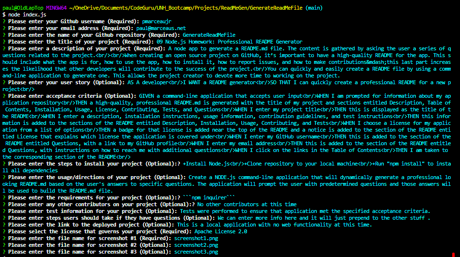
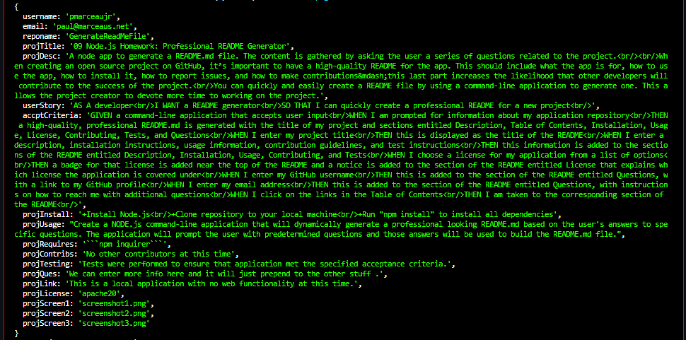

# __09 Node.js Homework: Professional README Generator__
[](https://choosealicense.com/licenses/apache-2.0)
## __Description__ 
 A node app to generate a README.md file. The content is gathered by asking the user a series of questions related to the project.<br/><br/>When creating an open source project on GitHub, it’s important to have a high-quality README for the app. This should include what the app is for, how to use the app, how to install it, how to report issues, and how to make contributions&mdash;this last part increases the likelihood that other developers will contribute to the success of the project.<br/>You can quickly and easily create a README file by using a command-line application to generate one. This allows the project creator to devote more time to working on the project.<br/>Because this application won’t be deployed, you’ll also need to provide a link to a walkthrough video that demonstrates its functionality. Revisit the Screencastify Tutorial in the prework as a refresher on how to record video from your computer. You’ll need to submit a link to the video _and_ add it to the README of your project.
## Table of Contents 
 - [User Story](#user-story) 
- [Acceptance Criteria](#acceptance-criteria) 
- [Installation](#installation) 
- [Usage](#usage) 
- [Required](#required) 
- [Testing](#testing) 
- [Questions And Support](#questions-and-support) 
- [Contributors](#contributors) 
- [Deployed Link](#deployed-link) 
- [Media Links](#media-links) 
- [License](#license) 

---
## __User__ __Story__ 
  AS A developer<br/>I WANT a README generator<br/>SO THAT I can quickly create a professional README for a new project 
## __Acceptance__ __Criteria__ 
  GIVEN a command-line application that accepts user input<br/>WHEN I am prompted for information about my application repository<br/>THEN a high-quality, professional README.md is generated with the title of my project and sections entitled Description, Table of Contents, Installation, Usage, License, Contributing, Tests, and Questions<br/>WHEN I enter my project title<br/>THEN this is displayed as the title of the README<br/>WHEN I enter a description, installation instructions, usage information, contribution guidelines, and test instructions<br/>THEN this information is added to the sections of the README entitled Description, Installation, Usage, Contributing, and Tests<br/>WHEN I choose a license for my application from a list of options<br/>THEN a badge for that license is added near the top of the README and a notice is added to the section of the README entitled License that explains which license the application is covered under<br/>WHEN I enter my GitHub username<br/>THEN this is added to the section of the README entitled Questions, with a link to my GitHub profile<br/>WHEN I enter my email address<br/>THEN this is added to the section of the README entitled Questions, with instructions on how to reach me with additional questions<br/>WHEN I click on the links in the Table of Contents<br/>THEN I am taken to the corresponding section of the README<br/>   
## __Installation__ 
  +Install Node.js<br/>+Clone repository to your local machine<br/>+Run "npm install" to install all dependencies   
## __Usage__ 
    You will start the application by typing "node index.js" in the command line.<br/>The application will then proceed to ask you a series of questions.  Some of the questions are marked as (Required) and some are (Optional).  You must provide an answer for the Required questions.   Once you have cycled through the questions, the application will display all your answers and a non-formatted version of your new README file.  The file will also be written to the local directory.   
## __Media__ __Links__ 
  
  ## Screenshot #1 Desc:  
    
   
  ##  Screenshot #2 Desc:  
    
   
  ## Video of application in use:  
   
## __Required__ 
   ```npm inquirer```  
## __Testing__ 
   Tests were performed to ensure that application met the specified acceptance criteria.    
## __Questions__ __And__ __Support__ 
  We can prepend additional stuff here, for the enefit of the project, but we can also just go with the default code by not entering anythin in the questions question.   
   If you have any questions about the application or the repository, please open an [issue](https://github.com/pmarceaujr/GenerateReadMeFile/issues) or contact me via email at paul@marceaus.net.   
 You can find more of my work on my [GitHub](https://github.com/pmarceaujr).  
## __Contributors__ 
  No other contributors at this time    
## __Deployed__ __Link__ 
  This is a local application with no web functionality at this time.  
## __License__ 
 This project is licensed under the [Apache License 2.0](https://choosealicense.com/licenses/apache-2.0).   
